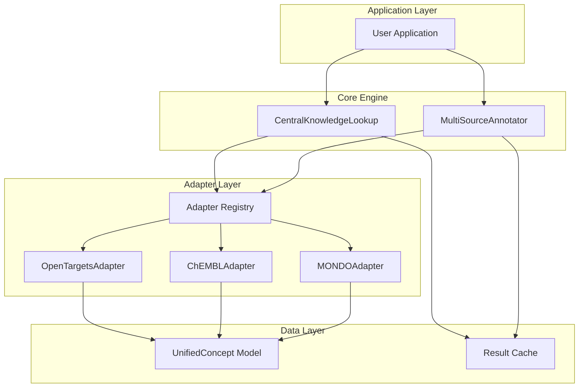

# Architecture Overview

This document provides a comprehensive overview of the Biomedical Knowledge Lookup architecture.

## High-Level Architecture



## Core Components

### CentralKnowledgeLookup

**Purpose**: Main entry point for knowledge source queries

**Key Responsibilities**:
- Query orchestration across multiple sources
- Rate limiting enforcement
- Result deduplication
- Error aggregation
- Caching management

**Key Methods**:
- `search_concepts()` - Concurrent multi-source search
- `get_concept_details()` - Detailed concept retrieval
- `get_concept_hierarchy()` - Ontology traversal
- `export_to_rdf()` - RDF export utilities

### MultiSourceAnnotator

**Purpose**: Text annotation using multiple knowledge sources

**Key Responsibilities**:
- Sentence tokenization
- Entity recognition
- Multi-source consensus
- Confidence scoring

### KnowledgeSourceAdapter (Abstract Pattern)

```python
class KnowledgeSourceAdapter(ABC):
    @abstractmethod
    async def search_concepts(query: str, limit: int) -> List[UnifiedConcept]:
        """Search for concepts matching query"""
    
    @abstractmethod
    async def get_concept_details(concept_id: str) -> Optional[UnifiedConcept]:
        """Get detailed information for a concept"""
    
    @abstractmethod
    def get_rate_limit() -> float:
        """Return rate limit in requests per second"""
```

**Adapter Lifecycle**:
1. Initialize with configuration
2. Check availability (`is_available()`)
3. Execute query with rate limiting
4. Parse response
5. Normalize to `UnifiedConcept`
6. Return results

## Data Models

### UnifiedConcept

**Purpose**: Standardized representation across all knowledge sources

**Key Attributes**:
- `primary_id` - Source-specific identifier
- `primary_label` - Preferred name
- `concept_type` - Entity type (disease, gene, drug, etc.)
- `definitions` - Concept definitions
- `synonyms` - Alternative names
- `identifiers` - Cross-references to other sources
- `data_sources` - Source-specific metadata

### LookupResult

**Purpose**: Container for search results

**Key Attributes**:
- `concepts` - Deduplicated list of concepts
- `results` - Per-source result breakdown
- `execution_time` - Total query time
- `errors` - Aggregated errors per source

## Data Flow

### Search Request Flow

```
User Query
    ↓
CentralKnowledgeLookup.search_concepts()
    ↓
[Concurrent Requests]
    ├─ OpenTargetsAdapter → GraphQL API → Normalized Concepts
    ├─ ChEMBLAdapter → REST API → Normalized Concepts
    └─ MONDOAdapter → REST API → Normalized Concepts
    ↓
Result Aggregation
    ↓
Deduplication (based on semantic similarity)
    ↓
LookupResult with UnifiedConcepts
    ↓
User Application
```

### Annotation Flow

```
Text Input
    ↓
Sentence Tokenization
    ↓
[Per-Sentence]
    ↓
Entity Recognition (text matching)
    ↓
[Per Entity]
    ↓
Multi-Source Search
    ↓
Consensus Analysis
    ↓
Confidence Scoring
    ↓
AnnotationResult
```

## Adapter Pattern Implementation

### Adapter Registration

```python
ADAPTER_CLASSES = {
    KnowledgeSource.OPENTARGETS: OpenTargetsAdapter,
    KnowledgeSource.CHEMBL: ChEMBLAdapter,
    KnowledgeSource.MONDO: MONDOAdapter,
    # ... all 29+ sources
}
```

### Adapter Factory

```python
def create_adapter(source: KnowledgeSource, config: LookupConfig):
    adapter_cls = ADAPTER_CLASSES.get(source)
    if not adapter_cls:
        raise ValueError(f"No adapter for source: {source}")
    return adapter_cls(config)
```

## Caching Strategy

### Cache Levels

1. **Request Cache**: HTTP response caching
2. **Result Cache**: Query result caching
3. **Concept Cache**: Deduplicated concept caching

### Cache Configuration

```python
config = LookupConfig(
    cache_enabled=True,
    cache_ttl=3600,  # 1 hour default
    cache_dir="./cache"
)
```

## Error Handling Architecture

### Error Types

- `SourceUnavailableError`: Endpoint unreachable
- `RateLimitError`: Rate limit exceeded
- `APIError`: Invalid API response
- `ConfigurationError`: Invalid configuration

### Error Propagation

```
Adapter Error
    ↓
Retry (if configured)
    ↓
Still Failed → Add to result.errors
    ↓
Continue with other sources
    ↓
Aggregate all errors in result.errors
```

## Performance Considerations

### Async Concurrency

- All adapter methods are async
- Queries execute concurrently using `asyncio.gather()`
- Connection pooling via `aiohttp.ClientSession`

### Rate Limiting

- Per-source rate limiting
- Token bucket algorithm
- Automatic backoff on rate limit errors

### Memory Management

- Streaming responses for large results
- Generators for result iteration
- Efficient deduplication algorithms
